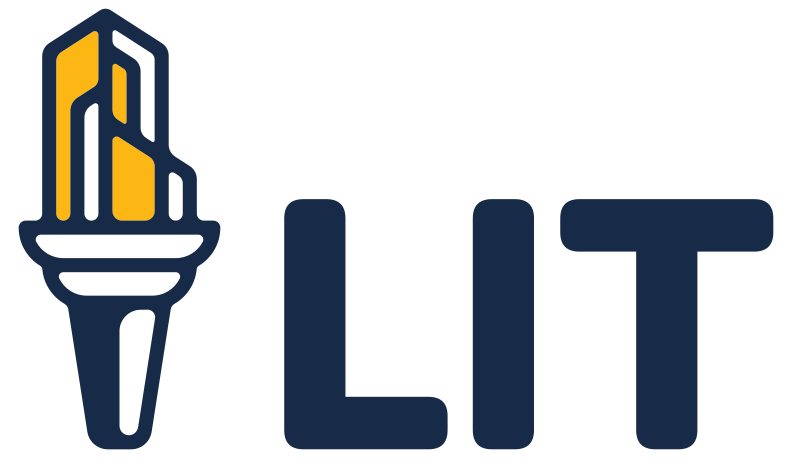

.image-height-sm.margin-bottom-lg[]

.color-suffolk-blue-dim[Building Access-to-Justice Infrastructure]
# Leveraging Open Source Software & Non Profit Partnerships

[Sam Glover](https://samglover.net) & [Jessica Frank](https://free.law/team/#:~:text=Jessica%20Frank%20%E2%80%93%20User%20Researcher%20and%20Project%20Manager)

???
Description:

> Ever wish you could benefit from the work other courts have put into customizing their systems? Or wish you could work with courts to build a system tailored to your needs? Well, you can.
> 
> As courts seek to expand access to justice, some are doing it in an open, sustainable way with open-source software and non-profit collaborations. Attendees will take away an understanding of 1) Digital public infrastructure and how it impacts software procurement, 2) The pros and cons of open-source software and how courts can use it, especially for access-to-justice projects, 3) How courts can leverage non-profit partnerships, 4) How to avoid RFPs that exclude open-source software and non-profit partnerships, and 5) Current open-source, access-to-justice projects courts should be aware of.

---

# Digital public infrastructure

---

## Open-source software

> In many cases, using open source software … is a reasonable or even superior approach to using their proprietary competition …."
> 
> <cite>["Why Open Source Software / Free Software (OSS/FS, FLOSS, or FOSS)? Look at the Numbers!"](https://dwheeler.com/oss_fs_why.html) by David A. Wheeler (2015)
</cite>

---

## Non-profit partnerships

* DIY
* DIWU
* DIFY

---

## Open-source & non-profit friendly RFPs

---

## Open-source A2J projects to know

* Docassemble
* Suffolk LIT Lab's Document Assembly Line & EFSP
* Free Law Project's e-filing project