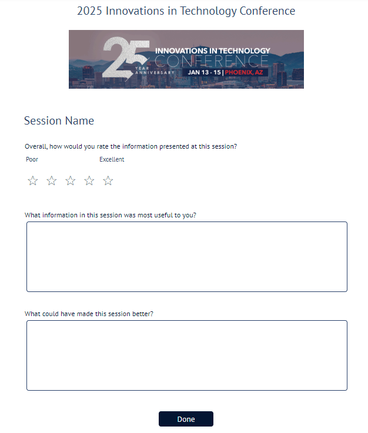

# E-Filing: Bridging the Gap Between Guided Interviews and Court Dockets

.grid.font-size-default.line-height-sm.margin-top-xl[
  **Jessica Frank**

  Free Law Project
]
.grid.font-size-default.line-height-sm[
  **Sarah Song**
  
  Illinois courts
]
.grid.font-size-default.line-height-sm[
  **Sam Glover**
  
  Suffolk LIT Lab
]
.grid.font-size-default.line-height-sm[
  **Vivian McNaughton**
  
  Illinois Legal Aid Online
]

???
Description:

> Guided interviews help self-represented litigants successfully assemble complex court forms. Connecting those interviews to e-filing helps SRLs navigate courts’ complex filing and service procedures, too. Together, they help make courts more accessible to everyone. In this session, you will learn how courts, legal aid organizations, and academic institutions are partnering to efficiently and effectively connect guided interviews to court dockets. Panelists from Illinois courts and legal aid will discuss the development of user-friendly e-filing systems, including integrated document assembly, SRL-specific e-filing interfaces, customer support, and more, using free resources, tools, and software developed by the Suffolk Legal Innovation & Technology Lab and being developed by the Free Law Project.

---

## Please provide session feedback in the ITC25 conference app

.grid.grid-2-1.gap-lg[
  .col.font-size-default[
  Find the link to the Session Survey at the bottom of the session description.

  If you don’t see the survey link in your app, make sure you have added the session to “My Schedule” in the app.
  ]
  .col.image-width-full[
    
  ]
]