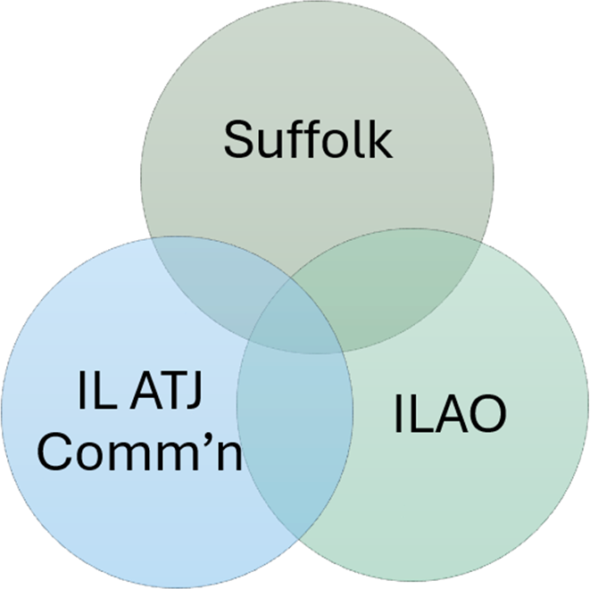

# E-Filing: Bridging the Gap Between Guided Interviews and Court Dockets

.grid.grid-auto.column-gap-lg.font-size-default.line-height-sm.margin-top-xl[
  **Jessica Frank**

  Free Law Project

  **Sarah Song**
  
  Illinois courts

  **Sam Glover**
  
  Suffolk LIT Lab

  **Vivian McNaughton**
  
  Illinois Legal Aid Online
]

???
**Introductions**
* Who you are
* What you do
* One thing that's not work-related that you'd love to talk about at receptions, affinity dinners, etc.

Session description, FYI:

> Guided interviews help self-represented litigants successfully assemble complex court forms. Connecting those interviews to e-filing helps SRLs navigate courts’ complex filing and service procedures, too. Together, they help make courts more accessible to everyone. In this session, you will learn how courts, legal aid organizations, and academic institutions are partnering to efficiently and effectively connect guided interviews to court dockets. Panelists from Illinois courts and legal aid will discuss the development of user-friendly e-filing systems, including integrated document assembly, SRL-specific e-filing interfaces, customer support, and more, using free resources, tools, and software developed by the Suffolk Legal Innovation & Technology Lab and being developed by the Free Law Project.

---

<i class="bi bi-map circled color-suffolk-gold font-size-xxl"></i>

## What we'll cover

.grid.line-height-sm[
.col[
1. Digital infrastructure
2. Online guided interviews
3. E-filing
]
.col[
<ol start="4">
  <li>Insights from the Illinois pilot project</li>
  <li>What's next</li>
  <li>Takeaways</li>
</ol>
]
]

---
class: center, middle

<i class="bi bi-question-circle-fill circled color-suffolk-gold font-size-3xhuge"></i>

???
* Please ask questions throughout!
* We've got plenty to say but we would prefer to have a discussion rather than just talk at you for an hour

---
class: middle

<i class="bi bi-building circled color-suffolk-gold font-size-xxl"></i>

## Digital infrastructure

???
3–5 mins

**Sam &rarr; Jessica**

* Courthouse technology is core public infrastructure, like roads and bridges to the courthouse
* (Hence "_bridging_ the gap" in the title of this session)
* Access to justice technology is about making it possible—or at least easier—for people to get from point A (having a legal problem) to point B (legal problem resolved)
* So what we're doing is building apps to improve navigation, like navigation aids or tour guides or translation phrase books
* I will continue to torture this metaphor over the next few slides

**Sam Q for Jessica: "You're an ITC OG and I'm a n00b. How do you think about digital infrastructure in relation to this community?"**

---
class: middle

<i class="bi bi-sign-turn-right circled color-suffolk-gold font-size-xxl"></i>

## Online guided interviews

???
3–5 mins

**Sam &rarr; Jessica &rarr; Vivian**

**Sam Q for Jessica: "Continuing the roads-and-bridges analogy, guided interviews are like using GPS to get somewhere, right?"**

Talking points/follow-up questions:
* Why use them? Aren't fillable PDFs good enough?
* Compare different options (Docassemble, A2J Author, Gavel, Guide & File, … ???)
* Considerations (accessibility, GUI v. code, mobile responsiveness, … ???)

**Sam Q for Vivian: "You're more directly involved with the user experience than the rest of us. Can you give us some insights into the advantages and disadvantages of guided interviews?**

Talking points/follow-up questions:
* Are there times when a guided interview isn't the best way to help someone complete a court form? Is it overkill for some forms?
* User testing insights/things that might not be obvious to a first-time interview builder

---
class: middle

<i class="bi bi-inbox circled color-suffolk-gold font-size-xxl"></i>

## E-filing

???
3–5 mins

**Sam &rarr; Sarah &rarr; Jessica**

* So we've gotten partway to point B, but now most litigants need to get out and walk. Or in this analogy, they still have to file and serve their court forms themselves.
* User-friendly e-filing is like the last bridge before point B: the courthouse
* But bridges can be hard to build, and many jurisdictions don't allow SRLs to e-file at all, or require them to use the same, complex system lawyers use
* At the LIT Lab, we built an open-source e-filing proxy server for guided interviews built with Docassemble, and it is being used in MA and IL

**Sam Q for Sarah: "Speaking of IL, maybe you could walk us through IL's SRL e-filing situation and why IL wound up as a leader on guided interviews and e-filing?"**

Talking points/follow-up questions:
* Difficulties due to SRLs not being able to e-file (burden on clerks, … ???)
* How does poorly-designed e-filing undermine trust in the judiciary?

**Sam Q for Jessica: "What are some of the obstacles to connecting guided interviews to a court's e-filing system?"**

Talking points/follow-up questions:
* What's hard about adding e-filing to guided interviews/for SRLs? (lack of software options, existing vendor contracts, funding … ???)

---
class: middle, moveup

.grid.grid-2-1[
  .col[
  <i class="bi bi-highlighter circled color-suffolk-gold font-size-xxl"></i>

  ## Insights from the Illinois pilot project
  ]

  .image-width-full[  ]
]

???
15–20 mins

**Sam &rarr; Sarah & Vivian**

**Sam Q for Sarah & Vivian: I'm just going to turn it over to you, now. Tell us about IL's pilot project and what we can learn from it.**

Talking points/follow-up questions:
* Roles in the project
* Implementation steps/details
* Mistakes made and lessons learned

---
class: middle

<i class="bi bi-brightness-alt-high circled color-suffolk-gold font-size-xxl"></i>

## What's next

???
5 mins

**Take turns; Sam go last**

* IL and ILAO plans for completing the pilot project—and what's next
* FLP's vision for a court user/SRL portal
* LIT Lab's general-purpose e-filing tool that is in development
* LIT Lab's work on AI-assisted online guided interviews

---
class: middle

<i class="bi bi-luggage circled color-suffolk-gold font-size-xxl"></i>

## Takeaways

???
3 mins

**Sam &rarr; all**

* What can someone who isn't a decisionmaker do to move things forward on guided interviews and e-filing?
* Online guided interviews + e-filing = greater access to justice!
* Both are necessary public infrastructure
* Work with the LIT Lab!
* Work with FLP!

---

## Please provide session feedback in the ITC25 conference app

.grid.grid-2-1.gap-lg[
  .col.font-size-default[
  Find the link to the Session Survey at the bottom of the session description.

  If you don’t see the survey link in your app, make sure you have added the session to “My Schedule” in the app.
  ]
  .col.image-width-full[
    
  ]
]