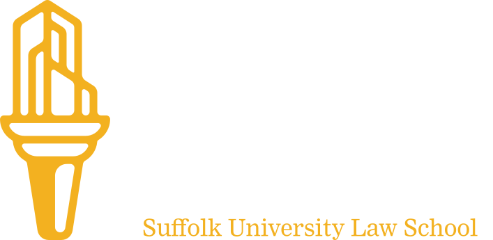

class: no-watermark

# Document  Assembly  Line

.dim.font-size-xxl.font-weight-lighter.margin-top-lg[
  OVERVIEW
]

.image-height-md.align-to-bottom.right[]
---
class: middle

> .font-size-lg[A well-designed form allows people to express themselves in a way the court can understand.]
> 
> <cite>David Colarusso, LIT Lab Co-Director</cite>

---
class: middle

## Open-source document assembly  and e-filing tools

???

We build, host, and support open-source document assembly and e-filing tools for courts and legal aid organizations

---
## Document assembly tools

Build beautiful, responsive, accessible online guided interviews with Docassemble and the AssemblyLine tools.

- Library of pre-built, user-tested questions and components
- Gentle learning curve
- Code handles complexity better than drag-and-drop tools

See examples at [courtformsonline.org](https://courtformsonline.org)

---
## E-filing tools

Suffolk's e-filing service provider (EFSP) delivers completed forms to court e-filing systems directly from Docassemble interviews.

- Removes a major obstacle for self-represented litigants (SRLs)
- Reduces the burden on court staff
- Certified for Tyler eFile & Serve, and customizable for other e-filing systems

---
## Free & open-source components

The following core components are free and open source thanks to an active community of courts, legal aid organizations, and volunteers.

.font-size-md.margin-top-lg[
  .row.align-items-center.gap-md.margin-bottom-md[
    <i class="bi bi-grid-1x2-fill circle font-size-xl rotate-90-cw"></i>
    
**Court Forms Online**

  ]

  .row.align-items-center.gap-md.margin-bottom-md[
    <i class="bi bi-gear-fill circle font-size-xl"></i>
    
**AL software**

  ]

  .row.align-items-cente.gap-md[
    <i class="bi bi-heart-fill circle font-size-xl"></i>
    
**Community**

  ]
]
---
## Funded partnership benefits

Funded partnerships with courts support the Document Assembly Line and enable us to provide additional services for our partners.

.font-size-md.margin-top-lg[
  .row.align-items-center.gap-md.margin-bottom-md[
    <i class="bi bi-inboxes circle font-size-xl"></i>
    
**E-filing**

  ]
  
  .row.align-items-center.gap-md.margin-bottom-md[
    <i class="bi bi-hdd-stack circle font-size-xl"></i>
    
**Hosting**

  ]

  .row.align-items-center.gap-md[
    <i class="bi bi-chat-dots circle font-size-xl"></i>
    
**Training & support**

  ]
]
---
## What's next

- LITEfile
- A low-code alternative editing interface for Docassemble
- ???

---
class: no-watermark
## .font-size-xxl.margin-bottom-0[The Document Assembly Line]

.font-size-xxl.margin-top-0.margin-bottom-lg[
  Learn more 
  Get started 
  Support the project
]

.row.align-items-center[
  <i class="bi bi-globe font-size-xl"></i>
  
  [assemblyline.suffolklitlab.org](https://assemblyline.suffolklitlab.org)
]

.row.align-items-center[
  <i class="bi bi-send font-size-xl"></i>
  
  [litlab@suffolk.edu](mailto:litlab@suffolk.edu)
]