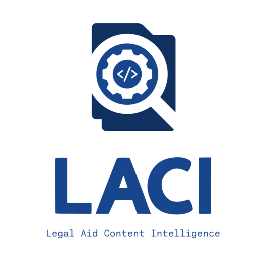

background-image: url(assets/itc26-title.png)
background-position: center
background-repeat: no-repeat
background-size: contain

---
<i class="bi bi-git circle font-size-xxl"></i>

# Open-source legal aid tools  .dim.font-size-xxl.font-weight-lighter[pros, cons, and procurement]

.grid.grid-auto.column-gap-lg.font-size-sm.row-gap-sm.margin-top-lg[
  **Luigi Bai**

  Lone Star Legal Aid 
  .dim[ [lbai@lonestarlegal.org](mailto:lbai@lonestarlegal.org) ]

  **Jessica Frank**

  Free Law Project 
  .dim[ [jessica@free.law](mailto:jessica@free.law) ]

  **Sam Glover**

  Suffolk LIT Lab 
  .dim[ [sam.glover@suffolk.edu](mailto:sam.glover@suffolk.edu) ]

  **Alison Paul**

  Montana Legal Services 
  .dim[ [apaul@mtlsa.org](mailto:apaul@mtlsa.org) ]
]

???
**Introductions**
- Who you are
- What you do
- Your experience with open-source software
- One thing that's not work-related that you'd love to talk about at receptions, affinity dinners, etc.

Session description, FYI:

> Open-source tools have the potential to reshape access to justice innovation with scalable, cost-effective tools. In this presentation we will look at real-word examples of open-source legal aid tools and explore the advantages and challenges of open-source solutions, including transparency, customizability, vendor independence, security, sustainability, and community. We will also compare open-source software and development with traditional software and help you decide whether to prefer or require open-source licenses in your technology projects.

---
class: middle

.row.align-items-center[
  <i class="bi bi-map circle font-size-xxl"></i>

  ## What we'll cover
]

- Key advantages and challenges of open-source tools
- How to evaluate open-source tools
- Tips for building community
- Key language to include in RFPs

---
class: center, middle

<i class="bi bi-question-circle-fill circle font-size-4xhuge"></i>

???
* Please ask questions throughout!
* We've got plenty to say but we would prefer to have a discussion rather than just talk at you for an hour

---
class: middle

<i class="bi bi-terminal circle font-size-xxl"></i>

## Why use open-source software?

???
**Q &rarr; Jessica: What is open-source and why are we talking about it?**

- Don't think of open source as free (no cost)
- But it is usually less expensive over time
- What it's free from is vendor lock-in
- Can avoid duplicating effort and leverage other open-source projects (like LACI + CourtListener)
- But you'll still have to pay service costs. **Infrastructure costs money.**

---
class: middle

<i class="bi bi-app circle font-size-xxl"></i>

## Open-source software examples

.grid.margin-top-lg[
  Email

  Websites

  [This slideshow](https://remarkjs.com)

  [LACI](https://codeberg.org/LACI)

  [Docassemble](https://docassemble.org/)

  [Spark](https://www.igniterealtime.org/projects/spark/)
]

???
([Spark](https://www.igniterealtime.org/projects/spark/) is an open-source instant messenging app MLSA relied on for **25** years!)

---
class: middle

<i class="bi bi-cone-striped circle font-size-xxl"></i>

## Open-source challenges

???
**Q -> Alison: What are the challenges of open-source tools?**

- You have to know more about them up front. It’s harder to say yes to than a well-established commercial product.
- If there isn’t a community, you’re kind of on your own for support. (Although you might be on your own with a commercial product, too.)
- Momentum

---
class: middle, center

.row.align-items-center.justify-content-center.margin-bottom-lg[
<i class="bi bi-search circle font-size-xxl"></i>

## Case study:
]

.image-height-md.border.dim[
  
]

???
**Q -> Luigi: Why did you choose to release LACI as an open-source tool?**

- Spread development costs around
- Leverage community

---
class: middle

<i class="bi bi-key circle font-size-xxl"></i>

## Community

???
**Q -> Jessica and Luigi: Community is definitely key. What goes into building and fostering one?**

- Give ownership
- Make it easy to join/contribute
- "Pop the bubble"—get outside of the A2J space to bring more people to the table
- Funders are part of the community

---
class: middle

<i class="bi bi-rulers circle font-size-xxl"></i>

## Evaluating open-source tools

???
**Q -> Alison: How should we evaluate open-source tools?**

- Be nosy
- Ask who it is maintained by, and how
- Evaluate long-term costs, not just up-front costs
- Is there an engaged community?
- Does the project have funders? Who?

---
class: middle

<i class="bi bi-magic circle font-size-xxl"></i>

## RFP language

???
**Q -> Alison and Luigi: What key language should we include in an RFP if we want to use or build open-source tools?**

- Two possibilities:
	- Use existing open-source tools to accomplish a goal
	- Build something that will be released with an open-source license
- Check your standard service contract to make sure it has an open-source option (or requirement)
- Open-source probably shouldn't be the deciding factor. There isn't always a good open-source option.
- But when nothing meets your current need, build something—and release it as open source

---
class: middle

<i class="bi bi-lightbulb circle font-size-xxl"></i>

## Closing thoughts

???
**Q -> all: Is there anything you didn't get to say that you wanted to?**

**Q -> all: What's your ask (small or big) for this audience?**

---
background-image: url(assets/itc26-feedback.png)
background-position: center
background-repeat: no-repeat
background-size: contain
